# Contents #

- [Application Architecture](#Application Architecture)
- [Flow Chart](#representations)
- [API](#authentication)
----------------------------------------

# Application Architecture
# Flow Chart
####  공공 와이파이 불러오기
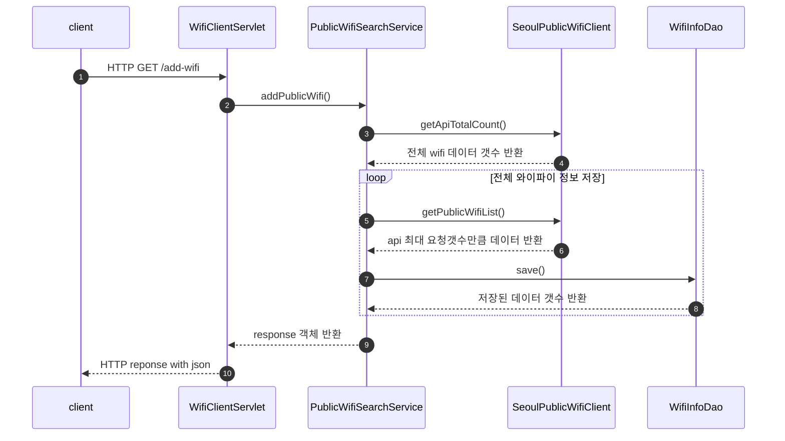
####  공공 와이파이 전체 조회
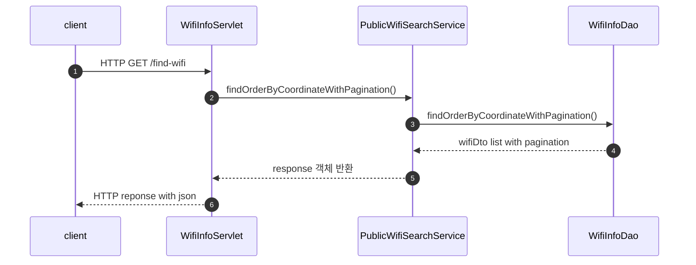
####  공공 와이파이 단건 조회
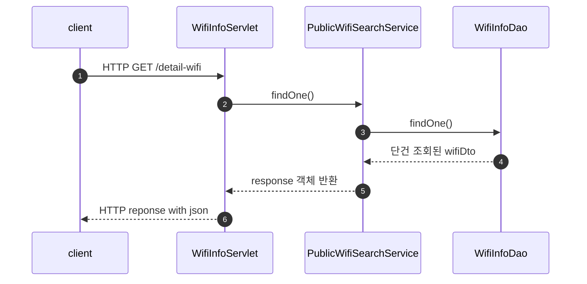
#### 히스토리 저장
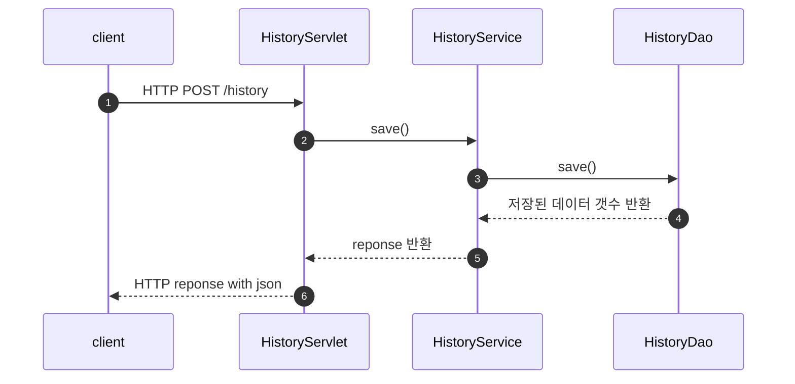
#### 히스토리 조회
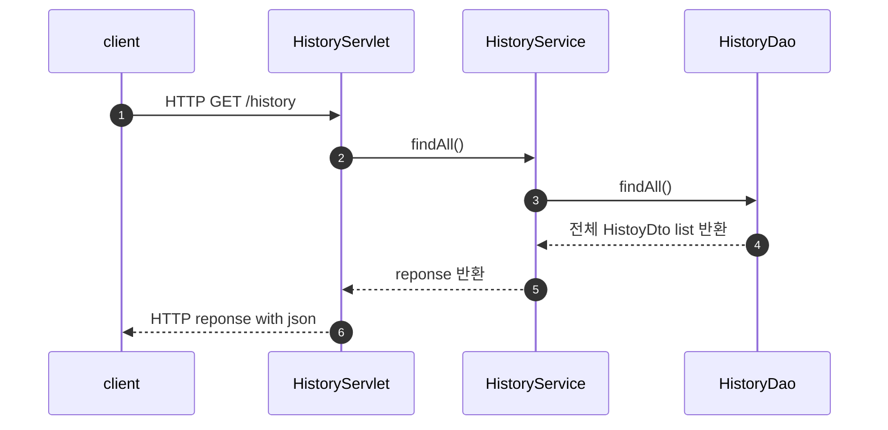
#### 히스토리 삭제
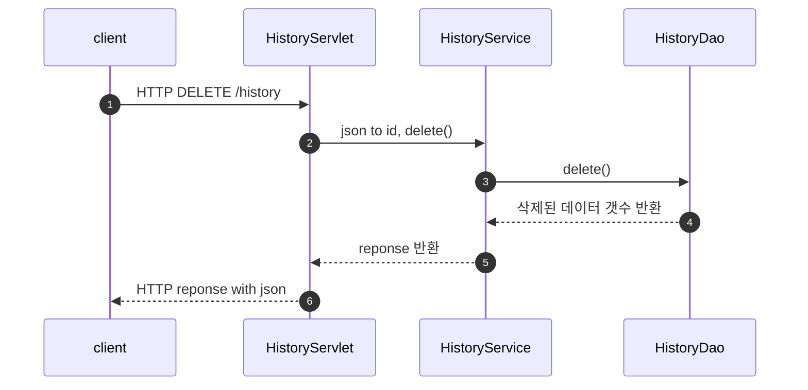
#### 북마크 그룹 저장
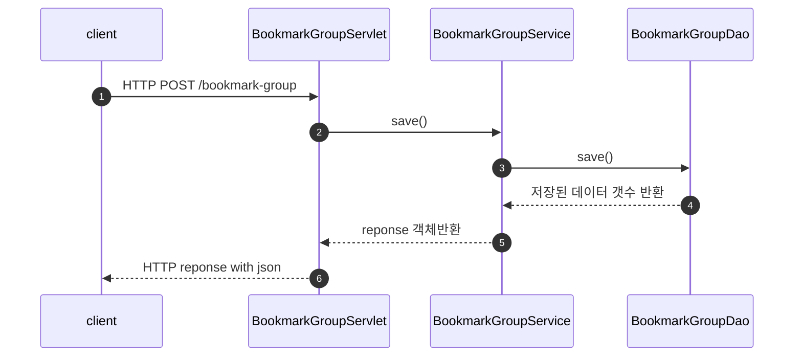
#### 북마크 그룹 조회
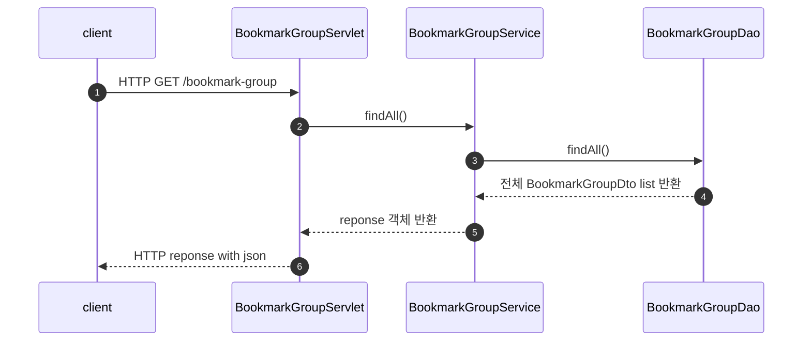
#### 북마크 그룹 수정
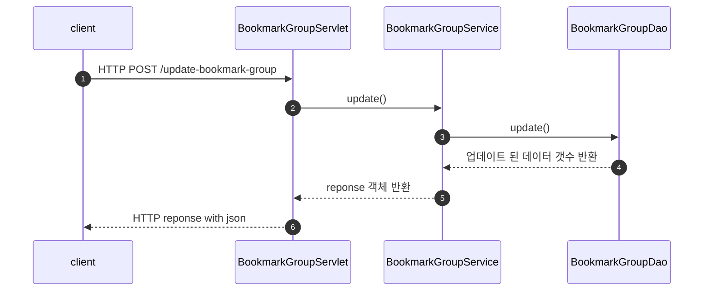
#### 북마크 그룹 삭제
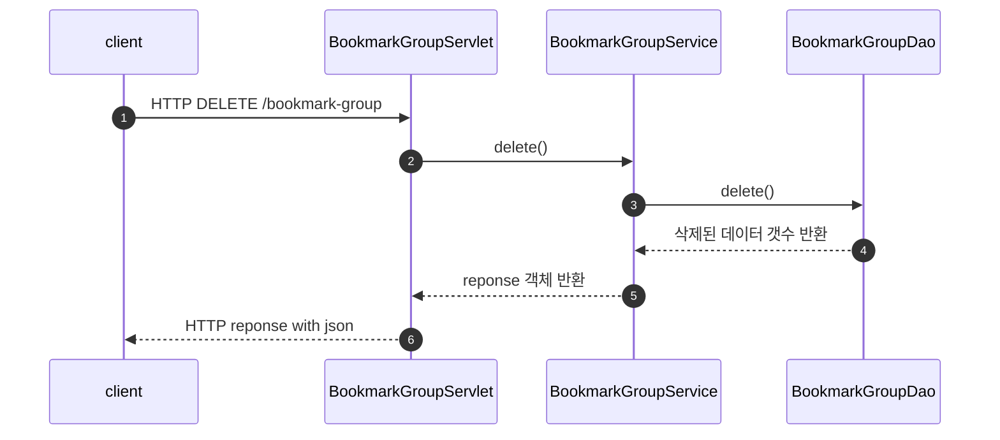
#### 북마크 저장
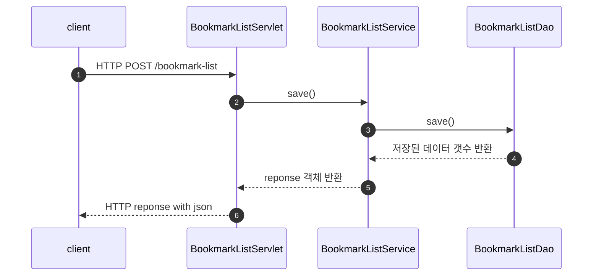
#### 북마크 조회
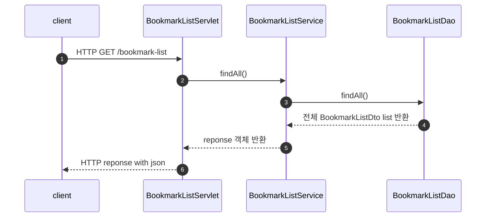
#### 북마크 삭제
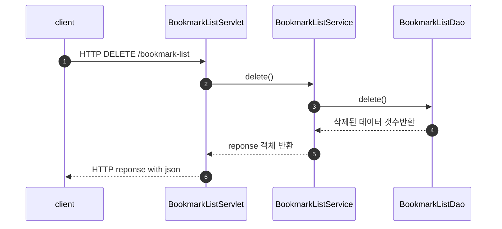

# API
