## STACK ##
- java 8
- tomcat 8.5
- servlet 4.0
- jdbc

# Contents #

- [Application Architecture](#application-architecture)
- [Flow Chart](#flow-chart)
- [API](#api)

----------------------------------------

# Application Architecture #
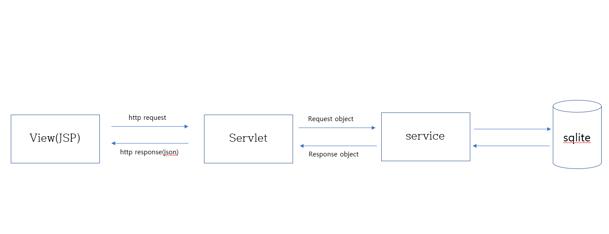
# Flow Chart #

#### 공공 와이파이 불러오기

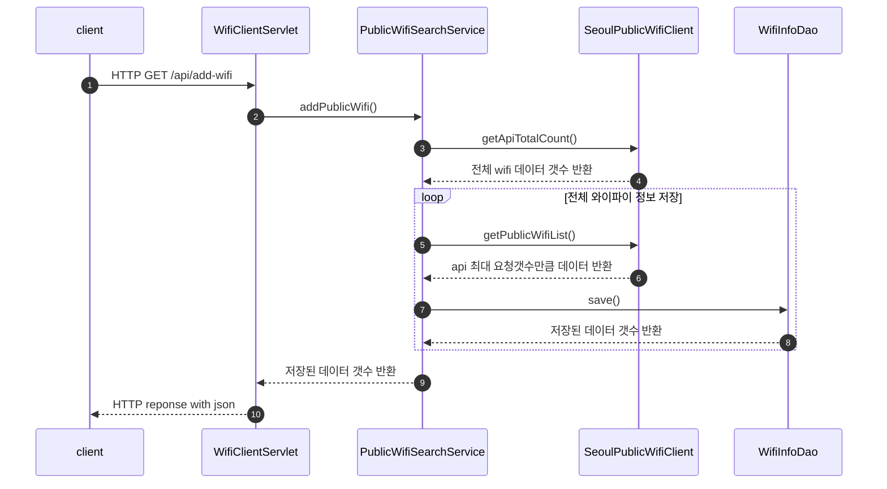

#### 공공 와이파이 전체 조회

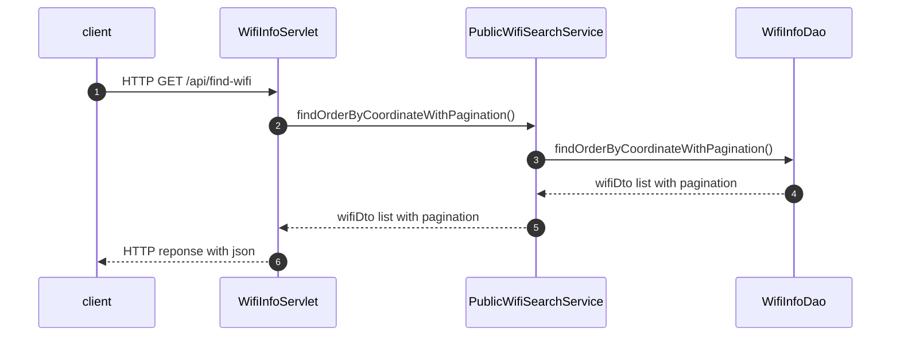

#### 공공 와이파이 단건 조회

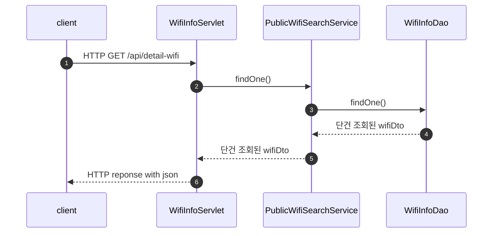

#### 히스토리 저장

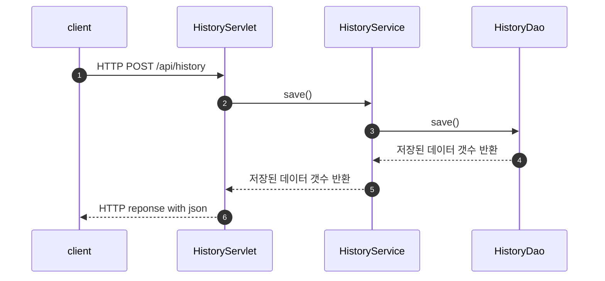

#### 히스토리 조회

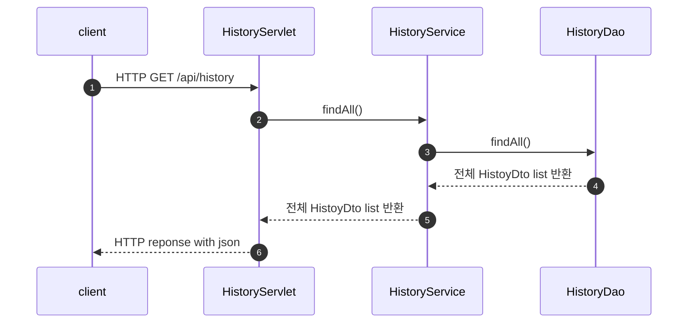

#### 히스토리 삭제

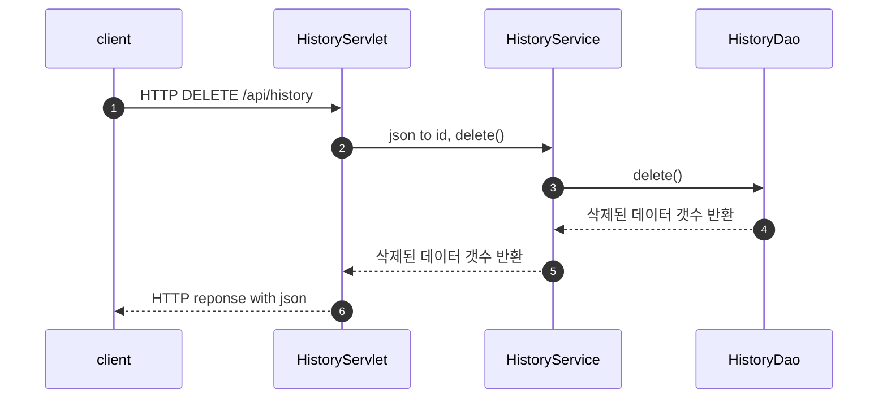

#### 북마크 그룹 저장

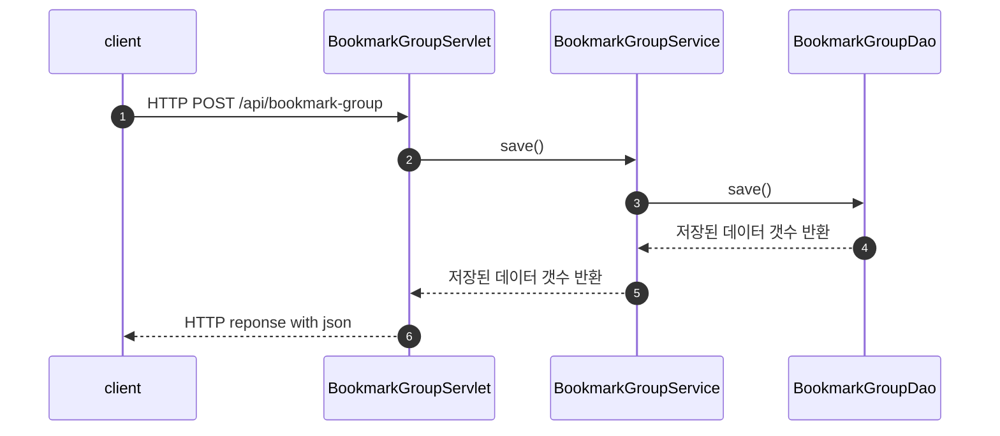

#### 북마크 그룹 조회

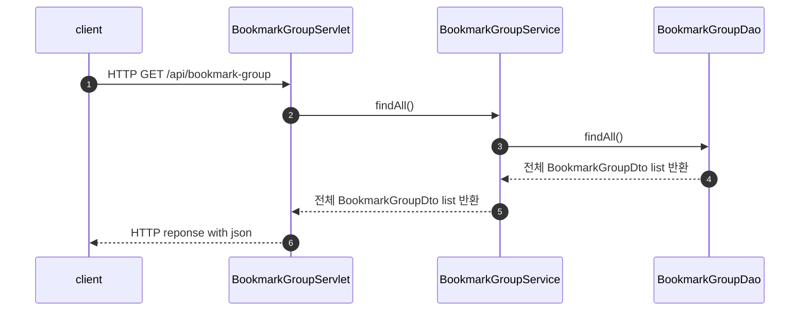

#### 북마크 그룹 수정

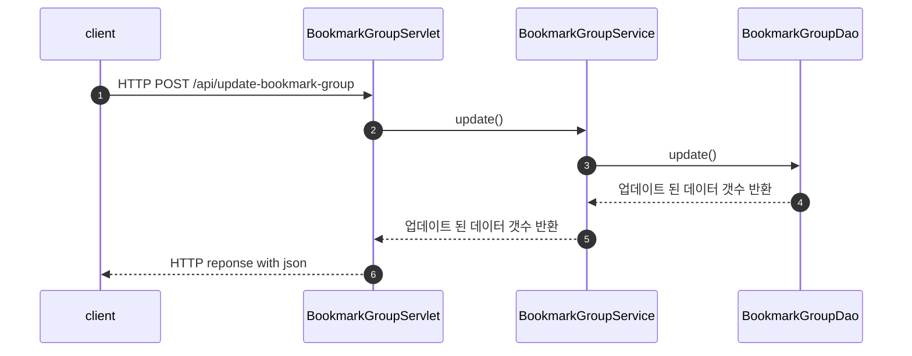

#### 북마크 그룹 삭제

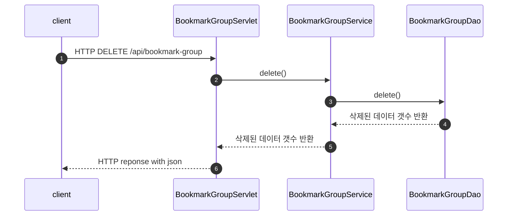

#### 북마크 저장

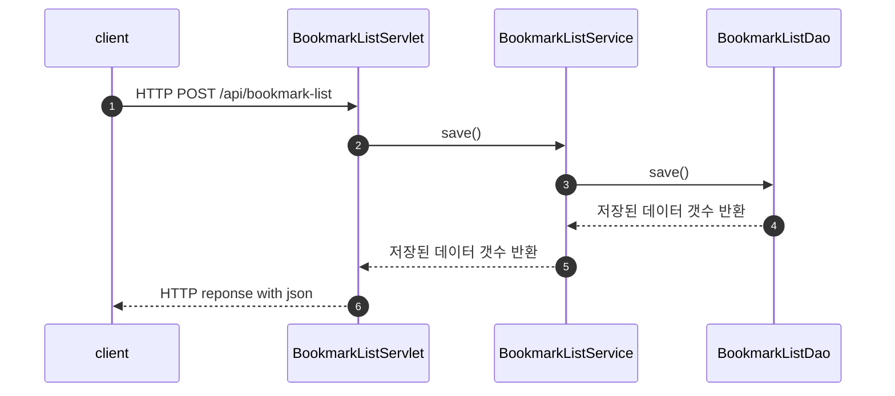

#### 북마크 조회

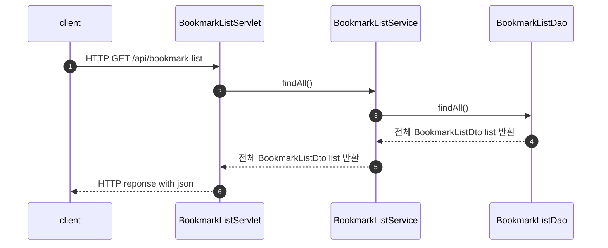

#### 북마크 삭제

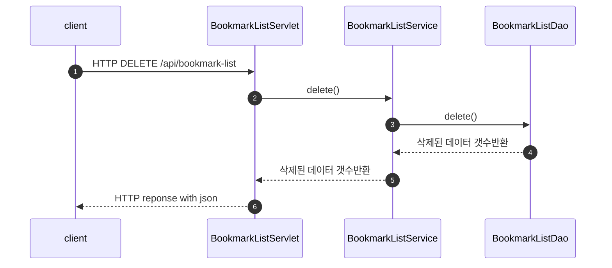

# API #

### 공공 와이파이 데이터 등록 ###

```http
GET /api/add-wifi HTTP/1.1
```

```http
HTTP/1.1 200 OK
Content-Type: application/json

{
    "entity": 23012 /*  저장된 공공 와이파이 데이터 갯수 */
}


```

### 공공 와이파이 전체 데이터 페이징 조회 ###

#### Query Parameters ####

`pageNumber` : 페이지 번호<br>
`latitude` : 위도<br>
`longitude` : 경도<br>

``` http
GET /api/find-wifi/pageNumber=100&latitude=30.55&longitude=120 HTTP/1.1 HTTP/1.1
```

```http
HTTP/1.1 200 OK
Content-Type: application/json

{
    "entity" : {
        "totalCount": 23012 /* 와이파이 데이터 전체 갯수  */,
        "wifiList": [
            {
                "distance": 15333.3,
                "mgrNo": "서울-10553",
                "WRDOFC": "서초구",
                "name": "말죽거리 골목상권",
                "streetAddress": "서울특별시 서초구 양재1동 남부순환로 356길 43",
                "detailAddress": "",
                "installFloor": "1",
                "installType": "1. 주요거리",
                "installMby": "디지털뉴딜(LG U+)",
                "svcEc": "과기부WiFi(복지시설)",
                "cmcwr": "인터넷망_뉴딜용",
                "cnstcYear": "2022",
                "inoutDoor": "실외",
                "remars3": "",
                "latitude": "0.0",
                "longitude": "0.0",
                "workDttm": "2023-04-27 10:58:30.0"
            },
            /* 페이징된 공공 와이파이 정보 데이터  */
        ]
    }
}
```

### 공공 와이파이 단건 조회 ###

#### Query Parameters ####

`mrgNo` : mrgNo<br>
`latitude` : 위도<br>
`longitude` : 경도<br>

``` http
GET /detail-wifi?mgrNo=SC22180001&longitude=120&latitude=30.55 HTTP/1.1
```

```http
HTTP/1.1 200 OK
Content-Type: application/json

{
     "entity": {
        "distance": 97.88,
        "mgrNo": "SC22180001",
        "WRDOFC": "서초구",
        "name": "내곡동체육시설",
        "streetAddress": "서초구 신흥망길 23-5 (내곡동)",
        "detailAddress": "센터건물 벽면",
        "installFloor": "1",
        "installType": "4. 문화체육관광",
        "installMby": "서초구",
        "svcEc": "공공WiFi",
        "cmcwr": "임대망",
        "cnstcYear": "2022",
        "inoutDoor": "실외",
        "remars3": "",
        "latitude": "37.457928",
        "longitude": "127.08255",
        "workDttm": "2023-05-05 10:58:26.0"
    }
}
```

### 히스토리 저장 ###

``` http
POST /history HTTP/1.1
Content-Type: application/json
 
{
    "latitude": "37.457928",
    "longitude": "127.08255"
}
```

``` http
HTTP/1.1 200 OK

{
    "entity": 1 /* 저장된 데이터 갯수  */
}
```

### 히스토리 전체 조회 ###

``` http
GET /history HTTP/1.1
```

``` http
HTTP/1.1 200 OK

{
    "entity": [
        {
            "id": 3,
            "latitude": 35.8546747,
            "longitude": 128.5012344,
            "createDate": "2023-05-06T09:28:07.947"
        },
        /* 조회된 히스토리 데이터  */
    ]
}
```

### 히스토리 삭제 ###

``` http
DELETE /history HTTP/1.1
Content-Type: application/json

{
    "id" : 1
}
```

``` http
HTTP/1.1 200 OK

{
    "entity": 1 /* 삭제된 데이터 갯수 */
}
```

### 북마크 그룹 저장 ###

``` http
POST /bookmark-group HTTP/1.1
Content-Type: application/json
 
{
    "name": "list1",
    "orders": 1
}
```

``` http
HTTP/1.1 200 OK

{
    "entity": 1 /* 저장된 데이터 갯수*/
}
```

### 북마크 그룹 업데이트 ###

``` http
POST /update-bookmark-group HTTP/1.1
Content-Type: application/json
 
{   
    "id" : 1,
    "name": "list1-1",
    "orders": 3
}
```

``` http
HTTP/1.1 200 OK

{
    "entity": 1 /* 업데이트 된 데이터 갯수*/
}
```

### 북마크 그룹 조회 ###

``` http
GET /bookmark-group HTTP/1.1
```

``` http
HTTP/1.1 200 OK

{
    "entity": [
        {
            "id": 1,
            "name": "list1-1",
            "orders": 3,
            "createDate": "2023-05-06T10:01:06.179",
            "modifiedDate": "2023-05-06T10:01:51.932"
        },
        {
            "id": 2,
            "name": "list2",
            "orders": 1,
            "createDate": "2023-05-06T10:01:12.080",
            "modifiedDate": ""
        },
        /* 조회된 북마크 그룹 데이터 */
    ]
}
```

### 북마크 그룹 삭제 ###

``` http
DELETE /bookmark-group HTTP/1.1
Content-Type: application/json

{
    "id" : 1
}
```

``` http
HTTP/1.1 200 OK

{
    "entity": 1 /* 삭제된 데이터 갯수 */
}
```

### 북마크 저장 ###

``` http
POST /bookmark-list HTTP/1.1
Content-Type: application/json
 
{
    "bookmarkGroupId": 1,
    "wifiName": "말죽거리 골목상권"
}
```

``` http
HTTP/1.1 200 OK

{
    "entity": 1 /* 저장된 데이터 갯수*/
}
```

### 북마크 조회 ###

``` http
GET /bookmark-list HTTP/1.1
```

``` http
HTTP/1.1 200 OK

{
    "entity": [
        {
            "id": 3,
            "bookmarkGroupName": "list1-1",
            "wifiName": "말죽거리 골목상권",
            "createDate": "2023-05-02T09:35:08.808"
        },
        {
            "id": 4,
            "bookmarkGroupName": "name3",
            "wifiName": "내곡동체육시설",
            "createDate": "2023-05-02T09:35:40.067"
        },
        /* 조회된 북마크 데이터 */
    ]
}
```

### 북마크 삭제 ###

``` http
DELETE /bookmark-list HTTP/1.1
Content-Type: application/json

{
    "id" : 1
}
```

``` http
HTTP/1.1 200 OK

{
    "entity": 1 /* 삭제된 데이터 갯수 */
}
```
